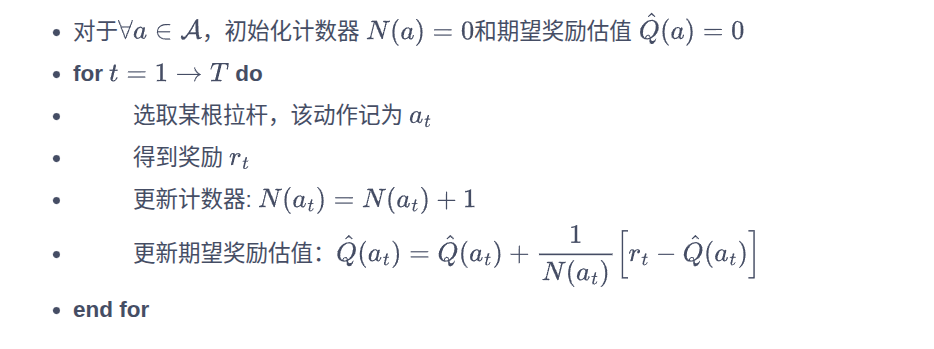
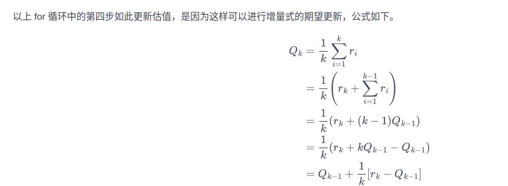
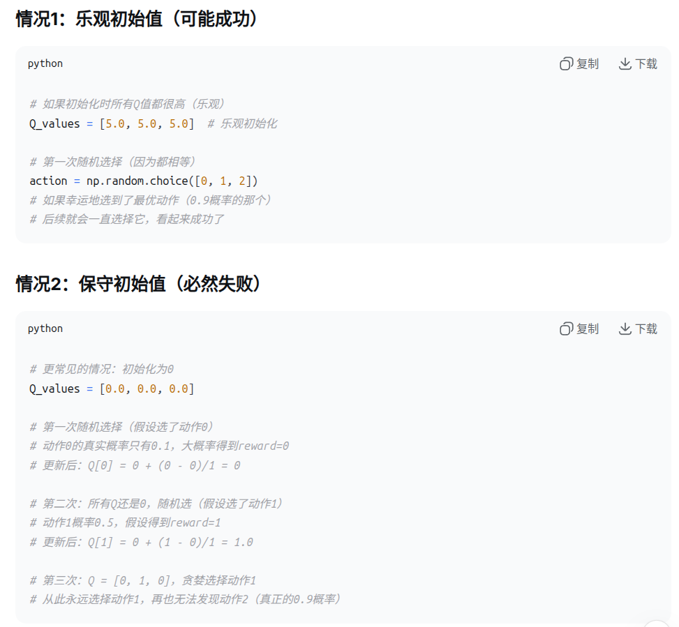
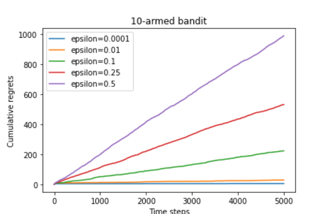
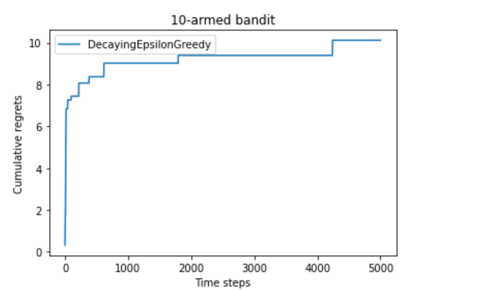
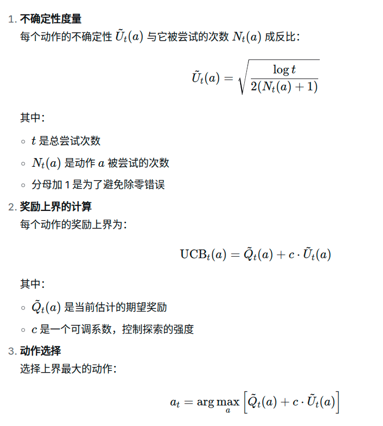

# 符号定义
**a**————动作

**r**————奖励

**R(⋅∣a)**————表示在给定动作 a 的情况下，奖励 r 服从的概率分布。

​**Q(a) = 𝔼_{r∼R(·|a)}[r]**————表示在动作a下获得的奖励的期望值。

**R(a)=Q\*-Q()**————懊悔，表示不是最优动作而带来的损失

**累加R(a)**————即是累加懊悔

# 问题介绍

多臂老虎机问题与强化学习的一大区别在于其与环境的交互并不会改变环境，即多臂老虎机的每次交互的结果和以往的动作无关，所以可看作无状态的强化学习（stateless reinforcement learning）。


假设你面前有一个老虎机，但这个老虎机有 K 个拉杆（多臂），每个拉杆被拉动时，给出的“奖励”是随机的，但每个拉杆有自己的奖励概率分布（比如有些容易中大奖，有些不容易）。

你不知道每个拉杆的中奖概率，但你有 T 次机会 去拉这些拉杆，目标是在这 T 次结束后，拿到尽可能多的累积奖励。

如果你总是拉目前看起来“最好”的拉杆（利用，exploitation），可能会错过真正更好的其他拉杆（因为你没有充分尝试它们）；
如果你花太多时间去尝试各个拉杆（探索，exploration），可能会浪费机会在差的拉杆上。
所以，要在“探索”和“利用”之间找到一个平衡，使总奖励最大。


## 积累懊悔
每一次的拉杆都有一个Q(a)与之对应，但是至少有一根拉杆的期望奖励是最高的，称之为Q*，在整个拉杆的过程中Q*为常数

MAB 问题的目标为最大化累积奖励，等价于最小化累积懊悔。

## 估计期望奖励——这个这是在学习过程中根据每次学习成果估计出来的每一个的奖励期望值，但这个问题本质上是无状态的，所以并为改变真实的

为了知道拉动哪一根拉杆能获得更高的奖励，我们需要估计拉动这根拉杆的期望奖励。由于只拉动一次拉杆获得的奖励存在随机性，所以需要多次拉动一根拉杆，然后计算得到的多次奖励的期望，其算法流程如下所示。




注意在代码中是先确定选哪个动作，在更新counts，所以在计算N(a)的时候你传入的k值其实是**选择之前**的，但公式中的是**选择后的**，所以要手动+1
## 框架

```py
class Solver:
    """ 多臂老虎机算法基本框架 """
    def __init__(self,bandint:BernulliBandit):
        self.bandint = bandint#获得多臂老虎机生成器
        self.counts = np.zeros(self.bandint.K)
        self.regret = 0
        self.actions = []#存储每一次的action和regret
        self.regrets = []
    
    def update_regret(self, k):
         # 计算累积懊悔并保存,k为本次动作选择的拉杆的编号
        self.regret += self.bandint.best_probability - self.bandint.probabilities[k]
        self.regrets.append(self.regret)
    
    def run_one_step(self):
        raise NotImplementedError
    def run(self, num_steps):
        # 运行一定次数,num_steps为总运行次数
        for _ in range(num_steps):
            k = self.run_one_step()
            self.counts[k] += 1
            self.actions.append(k)
            self.update_regret(k)
```

目前做到这里我们搭建好了框架，他可以记录每一次的懊悔和总懊悔，以及每一次的action

但是并没有策略（policy）怎么拿？第一次怎么拉拉杆

# 策略

最简单的策略就是一直拉取第一个，但这就非常依赖运气的好坏。如果运气绝佳，可能拉动的刚好是能获得最大期望奖励的拉杆，即最优拉杆；但如果运气很糟糕，获得的就有可能是最小的期望奖励。

一个经典的问题就是探索与利用的平衡问题。

探索（exploration）是指尝试拉动更多可能的拉杆，这根拉杆不一定会获得最大的奖励，但这种方案能够摸清楚所有拉杆的获奖情况。例如，对于一个 10 臂老虎机，我们要把所有的拉杆都拉动一下才知道哪根拉杆可能获得最大的奖励。

利用（exploitation）是指拉动已知期望奖励最大的那根拉杆，由于已知的信息仅仅来自有限次的交互观测，所以当前的最优拉杆不一定是全局最优的。例如，对于一个 10 臂老虎机，我们只拉动过其中 3 根拉杆，接下来就一直拉动这 3 根拉杆中期望奖励最大的那根拉杆，但很有可能期望奖励最大的拉杆在剩下的 7 根当中，即使我们对 10 根拉杆各自都尝试了 20 次，发现 5 号拉杆的经验期望奖励是最高的，但仍然存在着微小的概率—另一根 6 号拉杆的真实期望奖励是比 5 号拉杆更高的。

那么介绍一下具体的策略

##  ϵ-贪心算法
### 完全贪心算法
算法流程：
初始化：为每个动作赋一个初始价值估计（比如都为0）

每一步：选择当前估计值最大的动作

执行该动作，获得奖励

更新该动作的价值估计

永远不探索：只要某个动作的估计值最高，就永远选择它

### ϵ-贪心算法
贪婪算法在完全贪婪算法的基础上添加了噪声，每次以概率ϵ选择以往经验中期望奖励估值最大的那根拉杆（利用），以概率1-ϵ随机选择一根拉杆（探索）。



但是我们发现，无论怎么修改这个epsilon这个懊悔值还是增加。

故要引入随时间衰减

随着探索次数的不断增加，我们对各个动作的奖励估计得越来越准，此时我们就没必要继续花大力气进行探索。所以在ϵ-贪婪算法的具体实现中，我们可以令ϵ随时间衰减，即探索的概率将会不断降低。



## 上置信界算法——UCB

背景：

设想这样一种情况：对于一台双臂老虎机，其中第一根拉杆只被拉动过一次，得到的奖励为0；第二根拉杆被拉动过很多次，我们对它的奖励分布已经有了大致的把握。这时你会怎么做？或许你会进一步尝试拉动第一根拉杆，从而更加确定其奖励分布。这种思路主要是基于不确定性，因为此时第一根拉杆只被拉动过一次，它的不确定性很高。一根拉杆的不确定性越大，它就越具有探索的价值，因为探索之后我们可能发现它的期望奖励很大。

总结就是越没探索过的，越有潜力

**我们既要利用目前已知的最佳选择，也要探索那些还不确定的选项，以免错过潜在的高奖励机会。**


# QA
R(⋅∣a) 是保持不变的，意味着第1次从k个杆中拉的时候，此时每个杆的概率分布和第n次拉的时候每个杆的奖励概率分布是一样的